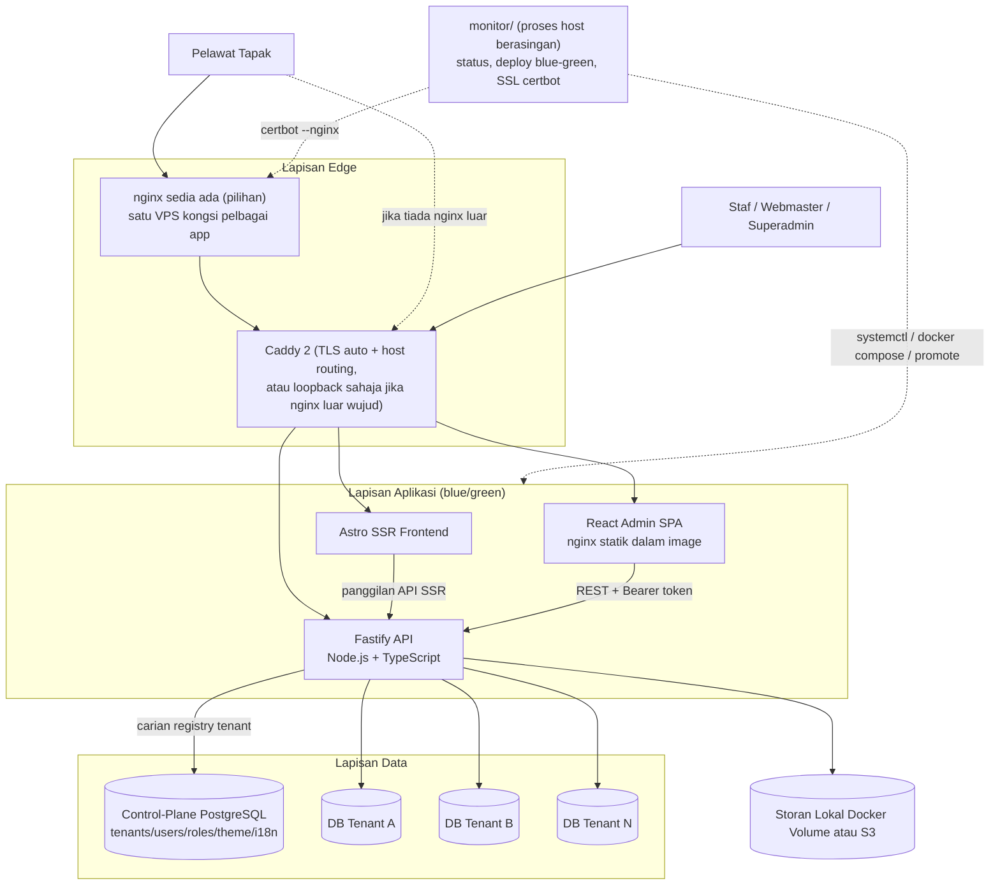

# Arkitektur & Tech Stack — USIM CMS

> Dokumen ini menerangkan **keadaan sebenar sistem pada 27 Ogos 2026** — bukan spec/cita-cita awal.
> Menggantikan versi lama (13 Julai 2026) yang sudah lapuk pada perkara asas (contohnya model
> multi-tenancy telah berubah daripada schema-per-tenant kepada **database-per-tenant**, dan hampir
> semua ciri di bawah dibina selepas versi lama itu ditulis). Rujukan sumber kebenaran teknikal harian
> ialah `CLAUDE.md` di root repo — dokumen ini ialah versi ringkas/tersusun untuk pembentangan dan
> onboarding.

---

## 1. Ringkasan Sistem

USIM CMS ialah **headless multi-tenant CMS** — satu *engine* tunggal yang menyampaikan berpuluh tapak
web jabatan/fakulti universiti daripada **satu deployment**. Menggantikan model lama (setiap jabatan
cPanel + WordPress berasingan) dengan satu instance yang dikongsi, dengan setiap jabatan (tenant)
terasing sepenuhnya di peringkat **pangkalan data** (bukan sekadar baris/schema).

Prinsip reka bentuk teras: **stabil, selamat, laju, mudah untuk staf bukan-teknikal**, dan
**elak dependency berat** — Tailwind + plugin Fastify ringan diutamakan berbanding framework besar.

Monorepo pnpm, tiga aplikasi:

| App | Peranan | Stack teras |
|-----|---------|-------------|
| `apps/api` | *Engine* backend — API, multi-tenancy, auth, storage, i18n, backup | Fastify 5 + Drizzle ORM + PostgreSQL |
| `apps/admin` | Dashboard pengurusan kandungan + Page Designer (untuk staf/webmaster/superadmin) | React 18 + Vite + Tailwind + Radix/shadcn |
| `apps/frontend` | Tapak awam yang dilihat pelawat | Astro 7 (SSR, `@astrojs/node`) |

Identiti tenant **sentiasa** datang dari header `x-tenant-host` pada setiap request — tidak pernah
daripada subdomain parsing atau config semasa boot. Inilah yang membolehkan satu deployment melayani
semua tapak jabatan serentak.

---

## 2. Tech Stack & Justifikasi

### 2.1 Backend — `apps/api`

| Teknologi | Versi | Kegunaan | Kenapa |
|-----------|-------|----------|--------|
| **Fastify** | ^5.1 | HTTP server / routing | Laju, JSON-schema validation terbina-dalam, sistem plugin/encapsulation sesuai untuk scope tenant (public vs protected). |
| **Drizzle ORM** | ^0.36 | Query builder + schema | Type-safe, *thin* — bukan ORM berat (tiada engine binari/generate step macam Prisma). SQL kekal dekat. |
| **pg** | ^8.13 | Driver Postgres mentah | Operasi luar liputan Drizzle: `CREATE DATABASE`, replay migration mentah, session variable RLS. |
| **TypeScript** | ^5.7, ESM/NodeNext | Bahasa + jenis | `strict: true` di seluruh repo. |
| **tsx** | ^4.19 | Jalan TS terus | Dev watch mode + semua CLI script tanpa build step. |
| **@fastify/helmet** | ^13 | Security headers | `contentSecurityPolicy: false` (API JSON sahaja, bukan penghasil HTML). |
| **@fastify/cors, @fastify/multipart, @fastify/static** | — | CORS, upload fail, hidang `/uploads/` | — |
| **sanitize-html** | ^2.17 | Nyah-cemar HTML body post/page | Trust boundary untuk kandungan editor kaya (BlockNote) sebelum simpan. |
| **@aws-sdk/client-s3 + lib-storage** | ^3.10 | Storage S3-compatible (pilihan) | Hanya dimuat bila `STORAGE_DRIVER=s3`. |
| **fflate** | ^0.8 | Zip/unzip | Backup/restore tenant (JSON + uploads dizip). |
| **drizzle-kit** | ^0.28 | Jana fail migration `.sql` daripada schema | *Authoring* sahaja — lihat §4 kenapa `db:migrate` tak dipakai semasa runtime. |

**Keputusan menarik — crypto ditulis sendiri.** Tiada `bcrypt`/`argon2`/library JWT. Guna `node:crypto`
sahaja: `scryptSync` untuk hash kata laluan (salt 16-byte rawak, `timingSafeEqual` untuk sahkan), HMAC-
SHA256 untuk token sesi stateless, dan implementasi **TOTP RFC 6238** tulis-sendiri untuk MFA (disahkan
terhadap vektor ujian rasmi RFC 6238 Appendix B dalam `auth.test.ts`). Pilihan "no bloat" yang matang.

### 2.2 Admin — `apps/admin`

| Teknologi | Versi | Kenapa |
|-----------|-------|--------|
| **React** | ^18.3 | UI. Routing sebenar guna **react-router-dom** (`BrowserRouter`) — Designer & Post Editor kini laluan (`route`) sebenar (`/content/pages/:id`, `/content/posts/:id`), bukan `useState` conditional mount. |
| **Vite** | ^5.4 | Dev server + bundler. |
| **Tailwind CSS** | ^3.4 | Styling utiliti. |
| **Radix UI (13 primitif) + shadcn convention** | — | Accordion, Dialog, Dropdown, Popover, Select, Tabs, Tooltip, dll. `components.json` + helper `cn()` — **sudah dipakai sebenar** (bukan scaffolding kosong seperti versi lama dokumen ini pernah nyatakan). |
| **@blocknote/core + react + mantine** | ^0.51 | Editor kaya (rich-text) untuk Post body, dengan toolbar tersuai + custom block `bookmarkCard` (`@`-mention content-search). |
| **react-hook-form + zod + @hookform/resolvers** | — | Borang. |
| **lucide-react** | — | Ikon (termasuk untuk medan `icon` info-box/mega-menu). |
| **embla-carousel** (dirujuk juga di frontend) | — | Digunakan selari dengan slider block. |

### 2.3 Frontend awam — `apps/frontend`

| Teknologi | Versi | Kenapa |
|-----------|-------|--------|
| **Astro** | ^7.1 | Render tapak awam — hampir-sifar JS klien secara default (island architecture). |
| **@astrojs/node** | ^11 | Adapter **SSR** mod `"middleware"` (`output: "server"`) — `server.mjs` sendiri milik `http.Server` supaya boleh tutup elegan pada `SIGTERM`/`SIGINT`. |
| **Tailwind CSS v4 + daisyUI** | ^4.3 / ^5.6 | Styling; daisyUI bekalkan set warna tema (UI Themes) yang dipetakan ke sistem tema tenant. |
| **embla-carousel + embla-carousel-autoplay** | ^8.6 | Satu-satunya dependency UI npm sebenar di frontend selain Tailwind — carousel headless ~6kb untuk elemen Slider (sentuh/drag/momentum/loop percuma). |

**Kenapa SSR, bukan SSG?** Identiti tenant diselesaikan daripada **Host header semasa runtime** — satu
instance melayani berpuluh domain berbeza. Pra-render statik tak boleh, sebab kandungan bergantung tenant
mana yang meminta pada masa request, bukan masa build.

### 2.4 Monorepo & tooling

- **pnpm workspace** (`pnpm@11.11`) — `packages: ["apps/*"]`.
- **`tsconfig.base.json`** — `strict: true`, `target: ES2022`; tiap app override module-resolution ikut
  runtime (api = NodeNext; admin = Bundler + JSX; frontend = extend `astro/tsconfigs/strict`).
- **ESLint 9 (flat config) + Prettier 3** di root — `pnpm lint` / `pnpm format`.
- **Ujian:** `node:test` (`tsx --test`) — bukan Jest/Vitest, konsisten falsafah no-bloat. Wujud di
  `apps/api` (`validate-layout.test.ts`, `validate-menu.test.ts`, `proxy-sync.test.ts`, `auth.test.ts`)
  dan mula dijalankan di `apps/admin` untuk fail helper `Designer.tsx` yang sudah diekstrak
  (`src/designer/{types,style,geometry,parsers}.ts`) — bahagian pertama refactor "God Component"
  Designer.tsx yang sedang berjalan berperingkat.

---

## 3. Struktur Monorepo

```text
usim_cms/
├── apps/
│   ├── api/                 # Fastify engine — DB, auth, storage, i18n, backup, proxy-sync
│   │   └── src/
│   │       ├── db/          # schema.ts, tenant-pool.ts, migrations/*.sql, auth.ts
│   │       ├── plugins/     # tenant.ts, auth.ts
│   │       ├── collections/ # config-types.ts, generic-crud.ts, validate-layout.ts, validate-menu.ts
│   │       ├── translate.ts # MyMemory auto-translate wrapper
│   │       ├── backup.ts    # export/import tenant (JSON + uploads, zip)
│   │       ├── proxy-sync.ts# push routing/upstream config ke Caddy Admin API
│   │       └── index.ts     # boot + daftar route
│   ├── admin/                # React SPA — dashboard staf + Page Designer
│   │   └── src/
│   │       ├── App.tsx       # Shell, routing, panel Content/Theme/Users/Roles/Settings/dll
│   │       ├── Designer.tsx  # Page builder (canvas, Inspector, Live Edit) — fail terbesar
│   │       ├── designer/     # Layer 0/1a refactor: types/style/geometry/parsers/fields/FieldControls
│   │       └── blocknote/    # Custom BlockNote block (bookmarkCard)
│   └── frontend/             # Astro SSR — tapak awam pelawat
│       └── src/
│           ├── pages/[...slug].astro, posts/[slug].astro, category/[slug].astro
│           ├── components/SectionBlock.astro, MenuBlock.astro, HeroBlock.astro, dll
│           └── lib/api.ts    # panggilan ke apps/api + resolvePostContent/resolvePageLayout (i18n)
├── monitor/                  # Agen sistem berasingan (systemd/host) — status, deploy, SSL certbot
├── scripts/deploy.sh         # Kitaran blue-green: build → health-check → promote → teardown
├── docker-compose.yml        # db + proxy (Caddy) — "base" sentiasa hidup
├── docker-compose.release.yml# api + frontend + admin — projek blue/green (-p ucms-blue/-p ucms-green)
├── docker-compose.trial.yml  # mod percubaan install.sh (tanpa Caddy, port terus)
├── Caddyfile
├── install.sh                # Pemasang VPS (docker/bare-metal, multi-distro)
├── install-dev.mjs           # Pemasang dev-lokal (Docker sahaja, cross-platform)
├── architecture.md, features-spec.md  # spec produk asal (rujukan niat, bukan status semasa)
├── CLAUDE.md                 # sumber kebenaran teknikal harian — paling terperinci & terkini
└── docs/ARSITEKTUR.md        # dokumen ini
```

---

## 4. Arkitektur Multi-Tenancy — Database-per-Tenant

Model sekarang: **satu pangkalan data Postgres berasingan bagi setiap tenant**, bukan satu schema dalam
pangkalan data dikongsi (versi lama dokumen ini). `DATABASE_URL` cuma memegang **control plane**:
jadual registry `tenants` / `users` / `roles` / `site_theme` / `shared_content` / `theme_presets` /
`languages` / `tenant_languages` / `login_attempts` / `audit_log` / `platform_settings`. Kandungan
tenant (`pages`, `posts`, `categories`, `menus`, `media`, dll) **tidak pernah** wujud dalam DB kawalan
ini.

### Aliran setiap request tenant-scoped

1. Request wajib hantar header `x-tenant-host` (cth `fst.usim.edu.my`) — `plugins/tenant.ts`.
2. `getTenantConnection(tenantHost)` (`tenant-pool.ts`):
   - Cari `host` dalam `tenants` (control plane). Tiada / `active=false` → **404**. **Trust boundary** —
     header sembarangan tak boleh cipta/provision DB baru.
   - Selesaikan connection string: `db_url` eksplisit pada baris `tenants` (topologi lain-server), atau
     terbitkan `postgres://.../tenant_<host>` pada server yang sama (`deriveTenantDbUrl`).
   - Kali pertama host itu dilihat oleh proses ini: `CREATE DATABASE` (jika belum wujud) + **replay
     semua fail `migrations/*.sql`** ke dalam DB tenant itu (idempoten — `IF NOT EXISTS`/`DROP POLICY IF
     EXISTS` di seluruh fail, tiada jadual jejak migration drizzle-kit di sisi tenant).
   - Pool Drizzle/pg dicache **per connection string** (`tenantPools`) — dua host yang kongsi `db_url`
     kongsi satu pool.
3. `req.db` (client Drizzle terikat DB tenant itu) + `req.tenantHost` dilampir oleh plugin.

### Kenapa database-per-tenant

- **Isolasi sebenar, bukan sekadar filter.** Query buggy/kompromi terhadap `req.db` satu tenant **tidak
  boleh** nampak baris tenant lain — beza pangkalan data, bukan sekadar `WHERE tenant_host=`. Ini lapisan
  di **atas** RLS (§5), bukan gantiannya.
- **Backup/restore/migrasi per-tenant mudah** — `apps/api/src/backup.ts` eksport JSON penuh + folder
  upload tenant itu sahaja, zip, boleh restore ke server lain (URL `/uploads/<host>/` ditulis semula
  automatik semasa restore silang-host) — asas ciri "clone tapak" di admin.
- **Topologi ialah data registry, bukan kod.** `tenants.db_url` null = terbitkan lokasi automatik pada
  server sama; diisi = tenant itu sengaja tinggal di server Postgres berasingan.

### Satu-satunya laluan silang-tenant yang disengajakan

- `public.shared_content` — ciri "Share to portal": webmaster tekan publish → baris disalin ke jadual
  kongsi di control plane; superadmin baca semua via `GET /api/portal/shared-content`. Tiada query
  merentas dua DB tenant secara langsung.
- `public.site_theme` — baris `tenant_host=""` = tema **global** (default superadmin); baris host lain =
  *override* tenant, digabung *shallow merge* (tenant menang per-key) oleh `getMergedTheme`.

---

## 5. Sistem Koleksi (Generic CRUD)

`apps/api/src/collections/config-types.ts` + `plugins/generic-crud.ts` ialah mekanisme code-first:
sebuah `CollectionConfig` (slug, fungsi `access` ikut peranan/jabatan, hook `beforeChange`/`afterChange`
yang terima `(data, args, req)` — boleh bezakan POST/PATCH via `req.method`, capai `req.db`/`req.user`)
didaftar melalui `registerPublicCollectionRoutes` / `registerProtectedCollectionRoutes`, yang pasang
route CRUD generik di `/api/:collectionSlug`. **Koleksi baru sepatutnya ditambah begini, bukan route
Fastify tulis-tangan berasingan.**

Koleksi aktif: **`pages`**, **`posts`**, **`templates`**, **`categories`**, **`menus`**.

Ciri generik yang terbina dalam mekanisme ini (dikongsi semua koleksi yang berkaitan, bukan ditulis
berulang):

- Filter query-string automatik pada `GET` list (`buildListFilters`) — exact-match kolum sepadan,
  `?tag=` array-contains, `?from=`/`?to=` julat `publishedAt`.
- `POST /:id/publish` ("Share to portal") — tolak baris yang `status` bukan `"published"`.
- `DELETE` pada FK `onDelete: "restrict"` yang masih dirujuk (cth kategori yang ada post) → tangkap kod
  ralat Postgres `23503`, pulang **409** tersusun, bukan 500 mentah.

---

## 6. Auth & Keselamatan

**Model peranan:**
- **superadmin** — `tenant_host` null. Urus tenant, pengguna, tema global, bahasa sistem. Dijaga
  `verifySuperadmin`.
- **webmaster** — dikunci ke **satu** tenant (`session.tenantHost !== req.tenantHost` → 403).

**Kata laluan:** `scryptSync` + salt 16-byte, banding `timingSafeEqual`.

**Token sesi:** `base64url(payload) + "." + base64url(HMAC-SHA256(payload, SESSION_SECRET))`. Payload
kini termasuk flag `previewOnly` (token pratonton berumur pendek untuk Live Edit / draf) dan `pendingMfa`
(sesi separuh siap semasa langkah TOTP).

**Row-Level Security (Postgres) — lapisan pertahanan kedua:** setiap jadual kandungan tenant
(`pages`/`posts`/dll) diaktif+dipaksa RLS, berpaksi flag sesi `app.authenticated`, di-*set* selepas token
sah dan **direset ke false setiap request** (client pool boleh bawa state lama). Role app
`usim_cms_app` (dicipta oleh `db:setup-role`) **NOBYPASSRLS** — sambungan superuser mengabaikan RLS secara
senyap, itu sebab role khas ini wajib.

**Pengerasan auth (respons kepada audit keselamatan "wajib diperbaiki"):**
- **Rate-limit log masuk** — jadual `login_attempts` (bukan kaunter in-memory, sebab blue-green/replika
  berbilang tak kongsi memori): 5 percubaan gagal per e-mel ATAU per IP dalam 15 minit → **429**, disemak
  **sebelum** kata laluan dicari (elak *timing oracle* pada akaun terkunci).
- **Log audit** — `audit_log` merekod pemadaman tenant/pengguna, toggle MFA — jawapan "siapa buat apa"
  peringkat superadmin, bukan change-data-capture penuh.
- **MFA (TOTP)** — `node:crypto` sahaja, RFC 6238. Suis dua peringkat: suis induk instance-wide
  (`platformSettings.mfaEnabled`, Settings tab) + suis pendaftaran individu pengguna
  (`users.totpEnabled`). Log masuk pulang `{mfaRequired: true, pendingToken}` bila diperlukan;
  `POST /api/auth/totp-verify` (turut dihadkan kadar) tukar kepada sesi sebenar. Titik lanjutan untuk
  Entra ID/SSO kelak (kad "coming soon" sudah ada di UI Settings, `signSession` tak kisah macam mana
  sesi terbentuk).
- **`@fastify/helmet`** dipasang; CSP dimatikan sengaja (API JSON sahaja).

**Diketahui belum dibuat (ditanda, bukan terlupa):** token sesi masih di `localStorage` bukan cookie
`httpOnly` — migrasi ini sentuh setiap request admin dan perlu strategi CSRF sendiri, sengaja tak
digabung dalam pusingan pengerasan yang sama. HA/replikasi Postgres, monitoring/alerting berterusan, dan
auto-rollback selepas promote juga belum — perlu keputusan topologi VPS sebenar.

---

## 7. Ciri Kandungan Utama

### 7.1 Page Designer (Builder)

Kanvas seret-lepas (Section → Row → Column → Element) dengan Inspector data-driven, sistem klip
(copy/paste/duplicate/save-as-template pada 4 tahap: section/row/column/element), kawalan responsif
sebenar per-breakpoint untuk **visibility** (`hideDesktop`/`hideTablet`/`hideMobile`, dirender sebagai
CSS `@media` sebenar di frontend) dan kawalan preview-sahaja untuk kebanyakan **style** override (bag
`bp`), kecuali teks slide (heading/subtitle slider) yang kini turut sebenar.

**Live Edit** — iframe tapak sebenar dengan jambatan `postMessage`, klik-untuk-pilih + edit dalam talian,
sentiasa mint token pratonton walaupun untuk halaman draf/private.

Elemen: heading/text/image/button/spacer/divider/embed/icon/list/html/gallery, ditambah accordion, tabs,
info-box, dan **slider/banner** (paling kaya — `slides` JSON array, setiap slaid ada imej/warna latar,
heading & subtitle boleh diposisi bebas + Typography penuh + resize seret pada kanvas dengan smart-guide
Figma-style, butang boleh diposisi bebas dengan warna/saiz/radius sendiri, transisi slide/fade,
navigasi/dots boleh gaya). Dirender di frontend guna **Embla Carousel**.

**Save as Template** peribadi (jadual `design_templates`) pada semua 4 tahap, dengan pratonton bentuk
(bukan screenshot sebenar) dalam modal carian/tapis.

### 7.2 Post/Article Editor

Editor skrin-penuh gaya Ghost — BlockNote rich-text + toolbar tetap, imej ciri, kategori (jadual sendiri,
FK `onDelete: restrict`), tag bebas, sejarah semakan (`post_revisions`, snapshot automatik setiap kali
status ditukar ke published/private), pratonton draf/private via token, dan `@`-mention bookmark card
untuk pautan dalaman pantas (`GET /api/content-search`).

### 7.3 Menu (Navigasi)

Jadual `menus` — pokok navigasi bersarang (item biasa + dropdown atau mega-menu, sehingga 3 tahap/8
lajur), disahkan `validate-menu.ts`. Elemen Designer `"menu"` cuma rujukan (`menuId`) — pokok sebenar
diedit di panel Menus, direalisasi di frontend oleh `MenuBlock.astro` (`resolveMenuTree`).

### 7.4 i18n (5 fasa, semua telah dibina)

- **Fasa 1** — daftar bahasa instans (`languages`, kelola superadmin).
- **Fasa 2** — subset bahasa didayakan per tenant (`tenant_languages`).
- **Fasa 3/4** — post/page bawa `language` + `translations` (jsonb, **satu baris** memegang semua
  bahasa — reka bentuk asal "satu baris per bahasa" telah ditolak selepas maklum balas langsung dan
  digantikan). Editor guna satu editor + pill penukar bahasa.
- **Fasa 5** — suis WPML-style: mesti diaktifkan dahulu (peringkat tenant + peringkat item) sebelum
  penukar bahasa ditunjuk pada pelawat.
- Auto-translate sebenar melalui MyMemory (`translate.ts`), bukan sekadar placeholder.

Butiran penuh setiap fasa (skema, editor, frontend resolve) — rujuk `CLAUDE.md`, seksyen Multi-tenancy.

---

## 8. Media Storage

`apps/api/src/storage.ts` — pilih driver via `STORAGE_DRIVER`:
- **`local`** (default) — `apps/api/uploads/<tenant>/`, dihidang `@fastify/static`.
- **`s3`** — endpoint mana-mana S3-compatible (AWS/MinIO/storan objek on-prem), `forcePathStyle` untuk
  bukan-AWS.

---

## 9. Deployment & Operasi



### 9.1 Docker Compose — Blue-Green Zero-Downtime

Dipecah kepada dua fail sengaja:
- **`docker-compose.yml`** — `db` + `proxy` (Caddy). "Base" yang sentiasa hidup, tak pernah ditutup
  semasa deploy.
- **`docker-compose.release.yml`** — `api`/`frontend`/`admin`. Dimulakan di bawah nama projek eksplisit
  `-p ucms-blue` / `-p ucms-green` supaya dua warna boleh hidup serentak.

`scripts/deploy.sh`: bina + mula warna **lain** → health-check kontena sebenar (`docker inspect`
`.State.Health.Status`) sehingga 90 saat → `POST /internal/deploy/promote` (dilindungi
`DEPLOY_SECRET`, `crypto.timingSafeEqual`) untuk tukar route Caddy secara atom melalui Admin API-nya
→ kemas kini `.deploy-color` → tutup warna lama. Sebarang kegagalan sebelum promote **tak menyentuh**
warna yang sedang live — selamat diulang.

### 9.2 Edge / TLS — tiga corak yang disokong

1. **Caddy sebagai edge tunggal** (default, kotak khusus) — Caddy pegang 80/443 terus, auto Let's
   Encrypt untuk setiap domain dalam `.env` (`ADMIN_DOMAIN`/`API_DOMAIN`/`TENANT_DOMAINS`), atau
   automatik penuh (buat/hapus tenant → domain auto wired) bila suis "Domain & SSL Automation"
   dihidupkan di Settings.
2. **nginx sedia ada sebagai edge** (VPS kongsi pelbagai app) — Caddy hanya dengar pada port loopback
   (`PROXY_BIND_HTTP=127.0.0.1:8090:80`), `auto_https off`, nginx luar (di luar repo ini) `proxy_pass`
   ke situ, memelihara header `Host`.
3. **nginx sebagai edge sepenuhnya, tanpa Caddy** — corak disyorkan untuk deployment organisasi sebenar
   (IT sudah kendali sijil/tadbir domain). `monitor/server.js`'s `POST /api/ssl/issue` jalankan
   `certbot --nginx` untuk keluarkan sijil auto bagi vhost yang IT belum ada sijil sedia ada.

### 9.3 Pemasang (installer)

- **`install.sh`** — VPS satu-langkah, sokong docker & bare-metal, auto-kesan keluarga OS
  (Debian/`apt`/`ufw` vs RHEL/`dnf`/`firewalld`), sahkan capaian luar sebenar (bukan sekadar healthcheck
  dalam kontena) dengan satu percubaan self-heal, dan pos terus kelayakan superadmin pertama ke
  `POST /api/setup`.
- **`install-dev.mjs`** — setara untuk dev lokal (Mac/Windows/Linux), Docker-sahaja, tanpa langkah
  khusus VPS (firewall/systemd/proxy/sijil).

### 9.4 Backup

- **`apps/api/src/backup.ts`** — eksport/import per-tenant (JSON + upload, zip fflate), boleh silang
  versi Postgres dan silang server (tulis semula laluan `/uploads/<host>/`). Asas ciri klon tapak &
  eksport tapak statik (`exportStaticSite`).
- **`apps/api/scripts/backup.sh`** — `pg_dump` peringkat instance (control-plane + semua DB tenant, atau
  satu tenant sahaja), dijadualkan cron, `RETENTION_DAYS` (default 14).
- **`apps/api/scripts/backup-media.sh`** — pasangan peringkat fail untuk folder uploads (tenant media
  besar, di mana eksport zip dalam-memori `backup.ts` tak praktikal — lihat `MAX_LOCAL_MEDIA_BACKUP_BYTES`).
  `rsync -a --delete --link-dest` mirror setiap `uploads/<tenantFolder>/` ke
  `BACKUP_DIR/media/<tenantFolder>/<timestamp>/`, hardlink terhadap snapshot lepas (jimat cakera), symlink
  `latest` sentiasa tunjuk snapshot terkini, `RETENTION_DAYS` sama macam `backup.sh`. Auto-kesan mountpoint
  volume Docker `ucms-uploads`; restore/migrate tenant hanya `rsync` biasa (ke folder lama atau server
  baru) — tiada kod aplikasi terlibat.

### 9.5 Monitoring

**Jurang diketahui** — `restart: unless-stopped` + healthcheck Compose cuma liputi restart-selepas-crash,
bukan metrik/alerting berterusan. `monitor/` (agen Node berasingan pada host, dikawal auth Basic) sedia
ada untuk status/restart/log/deploy/SSL manual, tetapi tiada dashboard metrik/alert automatik lagi.

---

## 10. Penilaian Ringkas

**Kekuatan:**
- Isolasi tenant sebenar (database-per-tenant) + RLS sebagai lapisan kedua.
- Pengerasan auth lengkap (rate-limit, audit log, MFA TOTP) hasil respons audit keselamatan sebenar.
- Deployment zero-downtime (blue-green) + pemasang VPS yang telah diperkukuh menerusi insiden sebenar
  (multi-distro, iptables, konflik port).
- Sistem koleksi generik (bukan route tulis-tangan berulang) dengan hook `access`/`beforeChange`/
  `afterChange` yang sudah *wired* dan dipakai sebenar (bukan stub — beza besar berbanding versi lama
  dokumen ini).
- Falsafah no-bloat konsisten dikekalkan walaupun ciri bertambah banyak (crypto sendiri, tiada ORM berat,
  carousel headless kecil sahaja sebagai satu-satunya dependency UI di frontend).

**Jurang diketahui (ditanda dalam kod/CLAUDE.md, bukan tersembunyi):**
- Token sesi masih `localStorage`, bukan cookie `httpOnly` — belum dijadualkan, perlu strategi CSRF
  berasingan.
- Tiada monitoring/alerting metrik berterusan; tiada load-test/capacity baseline rasmi.
- Sebahagian style-override responsif (bag `bp` pada Section/Row/Column/Element) masih preview-admin
  sahaja, belum dirender sebenar di tapak — kerja tambahan per-jenis elemen yang sengaja ditangguh.
- Refactor `Designer.tsx` ("God Component", ~50+ hook) baru sampai Layer 1a (field-schema + leaf
  controls diekstrak); `Inspector`/`ElPreview` — bahagian paling berisiko — masih ditangguh sehingga ada
  liputan ujian E2E (Playwright) yang dirancang.

---

*Untuk butiran penuh setiap ciri (skema jadual, nama fungsi, sebab keputusan reka bentuk, insiden yang
membentuk sesuatu ciri) — rujuk `CLAUDE.md` di root repo, yang dikemas kini serentak dengan setiap
perubahan kod dan menjadi sumber kebenaran teknikal harian.*
