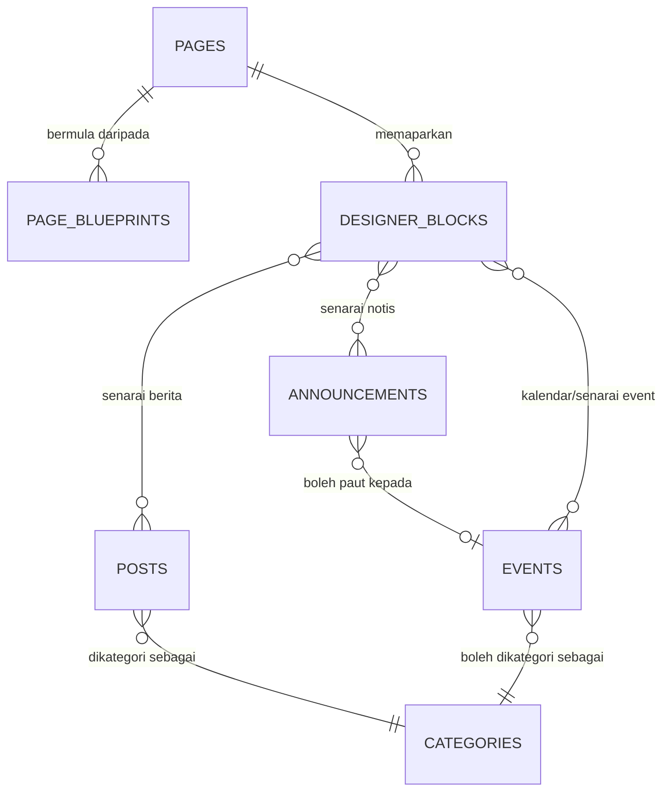
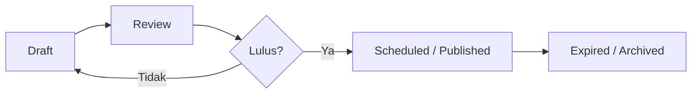

# Cadangan Ciri Penting USIM CMS

**Tujuan:** Dokumen cadangan produk dan roadmap feature untuk USIM Custom Multi-Tenant CMS.  
**Status:** Cadangan awal untuk perbincangan dan prioritisation.  
**Tarikh:** 23 Ogos 2026.

## 1. Ringkasan Cadangan

USIM CMS sudah mempunyai asas yang baik: page builder, posts, media, menu, theme, multilingual, role management dan multi-tenancy. Fokus feature seterusnya perlu meningkatkan dua perkara:

1. Memudahkan webmaster membina website profesional tanpa bermula daripada blank page.
2. Menyediakan jenis kandungan institusi yang biasa diperlukan, khususnya announcement dan events/calendar.

Cadangan utama ialah membina **Page Blueprint**, **Announcement**, **Events/Calendar**, dan menambah blok content dinamik dalam Designer. Semua feature perlu mengutamakan responsive design, accessibility, permission dan workflow penerbitan.

## 2. Prinsip Produk

- **Template-first, bukan blank-canvas-first:** pengguna bermula dengan layout yang berkualiti, kemudian customize.
- **Content model yang jelas:** berita, announcement dan event mempunyai lifecycle berbeza.
- **Configuration over custom code:** gunakan block, preset dan permission yang boleh digunakan semula oleh semua tenant.
- **Professional by default:** typography, spacing, responsive layout dan accessibility dijaga oleh sistem.
- **Progressive complexity:** editor biasa melihat setting penting dahulu; setting advanced hanya dibuka apabila perlu.
- **Safe publishing:** draft, preview, revision, validation dan approval dapat mengurangkan kesilapan public.

## 3. Model Kandungan Dicadangkan



| Collection | Tujuan | Cadangan |
|---|---|---|
| `pages` | Halaman statik/landing page | Kekalkan; gunakan Page Blueprint sebagai permulaan |
| `posts` | Berita, artikel, editorial | Kekalkan; tambah `contentType` jika announcement awal mahu dikendalikan bersama post |
| `announcements` | Notis rasmi, urgent atau berjadual | Collection sendiri apabila perlu priority, expiry, audience dan banner |
| `events` | Seminar, tarikh penting, program, aktiviti | Collection sendiri; menjadi sumber data kepada Calendar block |
| `categories` | Klasifikasi posts/events | Kekalkan; category bukan pengganti content type atau lifecycle |
| `page_blueprints` | Skeleton/layout lengkap sebelum create page | Collection baharu, system atau tenant scope |

## 4. Feature 1 — Page Blueprint / Starter Template

### Masalah yang diselesaikan

Blank page memberi kebebasan tinggi tetapi memperlahankan pengguna dan menyebabkan hasil visual tidak konsisten. Webmaster memerlukan titik mula yang siap, bukan perlu membina setiap section dari kosong.

### Cadangan

Apabila pengguna memilih **Create Page**, berikan dua pilihan:

```text
Create Page
├── Blank page
└── Choose blueprint
    ├── Preview desktop/tablet/mobile
    ├── Pilih blueprint
    └── Cipta draft dengan salinan layout blueprint
```

Blueprint perlu disalin ke page baharu. Mengubah page tidak mengubah blueprint asal atau page lain.

### Blueprint awal

| Blueprint | Struktur utama | Sasaran penggunaan |
|---|---|---|
| Landing page jabatan | Hero, quick links, stats, news, CTA, footer | Laman utama fakulti/jabatan |
| Profil organisasi | Hero ringkas, visi/misi, leadership, statistik, CTA | About/korporat |
| Program/perkhidmatan | Overview, feature cards, process, FAQ, CTA | Akademik dan perkhidmatan |
| News hub | Featured post, latest list, category area, CTA | Berita dan pengumuman |
| Event/kempen | Hero, event highlights, timeline, registration CTA | Kempen dan program |
| Contact | Contact info, operating hours, map area, FAQ | Unit/pejabat |
| Simple information page | Page title, rich text, callout, related links | Polisi dan prosedur |

### Permission

| Peranan | Keupayaan |
|---|---|
| Superadmin | Cipta/edit/publish system blueprint, lock mandatory section |
| Webmaster | Guna blueprint; simpan blueprint tenant jika dibenarkan |
| Editor | Guna blueprint untuk page baharu sahaja |

### Kriteria penerimaan

- Blueprint gallery mempunyai preview, kategori dan desktop/mobile view.
- Page baru ialah clone layout, bukan shared reference.
- Header/footer atau notis wajib boleh dikunci oleh superadmin.
- Blueprint memenuhi responsive dan accessibility baseline.

## 5. Feature 2 — Announcement

### Pilihan implementasi

#### Fasa awal: post dengan content type

Untuk notis biasa, gunakan `posts` dengan field tambahan:

```text
contentType: news | article | announcement
priority: normal | important | urgent
pinned: boolean
visibleFrom: datetime
visibleUntil: datetime
ctaLabel: string
ctaUrl: string
```

Ini pantas kerana post editor, revision, draft/publish dan frontend listing sudah ada.

#### Fasa matang: collection `announcements` sendiri

Gunakan collection sendiri apabila announcement memerlukan:

- auto-publish dan auto-expire;
- audience khusus, contohnya staf/pelajar/fakulti;
- severity atau urgency;
- alert banner pada seluruh tenant;
- workflow kelulusan berasingan;
- attachment dokumen rasmi;
- audit acknowledgement atau delivery notification.

### Cadangan UI

| Komponen | Fungsi |
|---|---|
| Announcement composer | Title, ringkasan, content, priority, audience, schedule, attachment, CTA |
| Announcement list | Filter status, priority, active/expired, audience |
| Alert banner block | Papar notis urgent/important yang masih aktif |
| Announcement list block | Papar notis aktif, pinned atau terbaru pada mana-mana page |

### Kriteria penerimaan

- Announcement expired hilang daripada public display secara automatik.
- Priority/urgency dipaparkan dengan text/icon, bukan warna sahaja.
- Admin boleh preview sebelum publish.
- Banner boleh diaktifkan tanpa perlu edit setiap page secara manual.

## 6. Feature 3 — Events dan Calendar

Calendar ialah **view**; sumber datanya ialah collection `events`. Ia tidak sesuai dimasukkan ke dalam posts kerana event memerlukan masa mula/tamat, lokasi, status dan pendaftaran.

### Schema asas event

```text
events
├── title
├── description
├── coverImageUrl
├── startAt
├── endAt
├── timezone
├── allDay
├── locationType: physical | online | hybrid
├── venue
├── meetingUrl
├── registrationUrl
├── capacity (optional)
├── status: draft | published | cancelled | postponed
├── categoryId (optional)
├── featured
└── language/translations
```

### Views dan blocks

| Block/view | Kegunaan |
|---|---|
| Upcoming events | 3–6 event akan datang pada landing page |
| Event list | Senarai dengan tarikh, lokasi dan CTA |
| Calendar month | Paparan bulan untuk aktiviti kampus yang banyak |
| Calendar list | Pilihan terbaik untuk mobile dan accessibility |
| Event detail | Halaman event dengan agenda, map, registration dan add-to-calendar |
| Featured event | Hero/card untuk event utama |

### Fasa event

1. **MVP:** one-off events sahaja, list view, detail page, registration URL.
2. **Fasa 2:** calendar month, category filter, ICS “Add to calendar”, cancelled/postponed state.
3. **Fasa 3:** recurring events, capacity, registration dalaman dan notification.

Jangan mulakan dengan recurring events. Recurrence, timezone dan exception date meningkatkan complexity dengan banyak.

## 7. Feature 4 — Blok Designer Bernilai Tinggi

| Keutamaan | Block | Kegunaan |
|---:|---|---|
| 1 | Card grid | Program, perkhidmatan, quick links, berita dan profil |
| 2 | Accordion/FAQ | Soalan lazim tanpa menjadikan page terlalu panjang |
| 3 | CTA banner | Pendaftaran, permohonan atau hubungi unit |
| 4 | Announcement list/alert | Notis aktif atau urgent |
| 5 | Post/news listing | Gunakan collection post sedia ada secara dinamik |
| 6 | Event list/calendar | Gunakan collection events |
| 7 | Stats | Fakta institusi, ranking dan pencapaian |
| 8 | People/directory cards | Pengurusan, pensyarah atau unit perkhidmatan |
| 9 | Logo cloud | Rakan kolaborasi, akreditasi atau penaja |
| 10 | Contact block | Alamat, waktu operasi, telefon/e-mel dan map link |

Setiap block perlu menyokong responsive setting, spacing preset, semantic HTML, accessibility warning dan reusable style variant.

## 8. Feature 5 — Content Quality dan Publishing Workflow

### Pre-publish quality check

Sebelum publish, papar checklist seperti:

- Title wujud dan unik.
- Heading hierarchy tidak melangkau tahap.
- Imej bermakna mempunyai alt text.
- Link/button tidak menggunakan label generik.
- Contrast memenuhi bacaan asas.
- Mobile preview telah disemak.
- Announcement/event mempunyai tarikh yang sah.

Warning boleh dibenarkan untuk override oleh webmaster; error kritikal perlu menghalang publish.

### Workflow masa hadapan



Mulakan dengan draft/published yang sudah wujud. Tambah review/approval hanya jika proses editorial USIM memang memerlukannya.

## 9. Dynamic Custom Collections Seperti Strapi

Codebase semasa ada generic CRUD collection secara **code-first**: developer mendaftarkan table, access policy dan hooks dalam TypeScript. Ia belum menyokong penciptaan collection melalui admin UI seperti Strapi.

### Cadangan

Jangan jadikan dynamic custom collection sebagai feature awal. Ia memerlukan:

- schema builder UI;
- migration yang selamat;
- row-level security bagi setiap collection;
- validation dan relation designer;
- permission matrix;
- API generation;
- admin list/form generation;
- backup/restore/migration support;
- audit trail dan versioning.

Lebih selamat membina collection yang benar-benar diperlukan dahulu (`announcements`, `events`, `page_blueprints`). Selepas domain model stabil, barulah nilai keperluan schema builder yang lebih terhad, contohnya custom fields pada collection tertentu.

## 10. Roadmap Dicadangkan

| Fasa | Feature | Nilai utama |
|---|---|---|
| 1 | Page Blueprint gallery + clone-to-page | Cepat bina halaman profesional dan konsisten |
| 1 | Card grid, FAQ, CTA block | Menyokong majoriti landing page institusi |
| 1 | Pre-publish accessibility checks asas | Kualiti content lebih baik secara default |
| 2 | `contentType` untuk post + announcement list block | Notis mudah tanpa schema besar |
| 2 | Events MVP + upcoming event block | Menyokong program/aktiviti akademik |
| 2 | Search/filter/sort bagi content | Mengurus content yang semakin banyak |
| 3 | Announcement collection dedicated | Notis urgent, audience dan schedule matang |
| 3 | Calendar view + ICS | Pengalaman event yang lengkap |
| 4 | Approval workflow, notification dan recurring event | Hanya apabila process owner memerlukan |
| 5 | Dynamic custom collection builder | Selepas model keselamatan dan operasi matang |

## 11. Keputusan Produk yang Dicadangkan

1. Teruskan dengan Page Blueprint sebagai feature keutamaan tertinggi.
2. Gunakan post dengan `contentType: announcement` untuk MVP announcement.
3. Sediakan `announcements` collection sendiri apabila terdapat keperluan urgent, expiry, audience atau alert banner global.
4. Bina `events` sebagai collection sendiri; Calendar hanyalah paparan untuk events.
5. Jangan bina dynamic custom collection seperti Strapi pada fasa awal.
6. Pastikan semua feature baharu boleh digunakan melalui Designer dan mematuhi responsive/accessibility baseline.

## 12. Rujukan Dokumen Berkaitan

- `docs/laporan-audit-ui-ux.md` — audit UI/UX, Page Blueprint dan cadangan elemen Designer.
- `docs/laporan-penambahbaikan-seni-bina.md` — seni bina, scalability dan engineering improvement.

