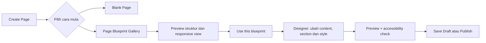
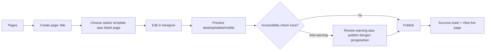
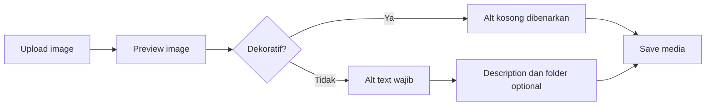

# Laporan Audit UI/UX

**Sistem:** USIM Custom Multi-Tenant Headless CMS  
**Tarikh:** 22 Ogos 2026  
**Jenis audit:** Heuristic review berasaskan source code  
**Skop:** Admin panel React, page builder/Designer dan website Astro frontend  

## 1. Ringkasan Eksekutif

Antaramuka sistem mempunyai asas UX yang baik untuk CMS institusi: navigasi mengikut peranan, pengurusan kandungan, preview, draft/publish, media library, revision history, tema, multilingual dan visual page builder semuanya telah tersedia. Ini menunjukkan produk mempunyai depth fungsi yang tinggi.

Namun, pengalaman keseluruhan masih cenderung kepada **desktop-first dan expert-first**. Ia kuat untuk webmaster yang sudah biasa dengan CMS, tetapi berpotensi membebankan pengguna baharu kerana density kawalan tinggi, teks kecil, serta pilihan tindakan yang banyak dalam satu skrin. Accessibility juga belum konsisten, khususnya pada label form, status/error announcement, tab, butang ikon, menu dropdown dan keyboard support bagi Designer.

**Skor heuristic UI/UX semasa: 6.5/10.**

Skor ini bukan hasil usability test dengan pengguna sebenar. Ia ialah penilaian pakar berdasarkan struktur UI dan tingkah laku yang dapat disahkan melalui code.

## 2. Persona Utama dan Keperluan UX

| Persona | Tugas utama | Keperluan UX |
|---|---|---|
| Superadmin | Mengurus tenant, user, role, security dan deployment | Gambaran sistem, perlindungan tindakan berisiko, konteks tenant yang jelas |
| Webmaster | Membina page, menulis post, upload media, mengurus menu/tema | Aliran kerja cepat, preview jelas, auto-save/unsaved-state, bantuan dalam konteks |
| Editor kandungan | Menulis dan menerbitkan artikel | Editor tanpa gangguan, status jelas, revision dan tindakan penerbitan selamat |
| Pelawat website | Membaca content, navigasi menu, menukar bahasa | Navigation mudah, mobile-friendly, loading/error yang baik, accessibility asas |

## 3. Kekuatan UI/UX

### 3.1 Information architecture admin adalah jelas

Sidebar memisahkan navigasi kepada **Main** dan **Content**, dan item menu berubah mengikut peranan pengguna. Ini mengurangkan akses kepada fungsi yang tidak relevan untuk webmaster biasa.

Kekuatan khusus:

- Superadmin dan webmaster menerima navigation scope yang berbeza.
- Content disusun lagi kepada Pages, Posts, Media, Theme, Languages dan Menus.
- Site picker disediakan untuk pengguna yang mengurus lebih daripada satu tenant.
- Banner impersonation menjadikan mod “view as user” lebih jelas.

### 3.2 Aliran kerja content mempunyai feedback yang baik

Sistem menyokong:

- Quick-create page/post dengan title sahaja.
- Draft, published dan private status.
- Preview untuk content draft dan published.
- Confirmation dialog untuk tindakan destructive.
- Toast untuk tindakan seperti share.
- Revision history dan restore post.
- Media picker dan upload state.

Ini memenuhi prinsip UX penting: pengguna perlu tahu status kerja, boleh membatalkan tindakan berisiko, dan boleh kembali kepada versi terdahulu.

### 3.3 Designer ialah differentiator produk yang kuat

Designer menyediakan banyak fungsi bernilai tinggi:

- Elements dan Layers view.
- Live view dan block view.
- Desktop, tablet dan mobile preview.
- Undo/redo.
- Duplicate, copy/paste dan copy/paste style.
- Template reusable.
- Inline editing dan drag/reorder.
- Preview sebelum publish.

Ia menjadikan CMS lebih sesuai untuk pengguna bukan teknikal berbanding editor JSON atau form yang semata-mata berasaskan field.

### 3.4 Theme editing lebih matang daripada CMS asas

Theme panel menyediakan preview serta-merta, theme preset, font pairing, import/export dan indikator readability untuk warna/font. Ini memberi pengguna confidence semasa menukar branding dan membantu mengurangkan risiko text yang tidak jelas dibaca.

### 3.5 Frontend mempunyai asas responsif dan accessibility

Frontend mempunyai navigation mobile, `aria-expanded` pada hamburger menu, keyboard-friendly `:focus-within` untuk dropdown, lazy loading untuk banyak imej, semantic `nav` dan `main` pada beberapa template halaman.

## 4. Isu dan Cadangan Penambahbaikan

### P0 — Admin panel belum responsif secara menyeluruh

**Dapatan:** Shell admin menggunakan sidebar tetap `w-64`, header desktop dan padding content `p-8`. Designer pula menggunakan palette kiri dan inspector kanan yang kekal pada skrin. Responsive Tailwind utilities ada pada card/grid tertentu, tetapi bukan pada shell atau Designer utama.

**Impak UX:** Pada tablet atau telefon, pengguna perlu horizontal-scroll atau tidak dapat melihat content/controls dengan selesa. Designer khususnya tidak praktikal untuk kerja mudah alih.

**Cadangan:**

1. Jadikan sidebar sebagai drawer/sheet pada skrin kecil.
2. Ringkaskan header kepada title + tindakan utama + overflow menu di bawah 1024px.
3. Jadikan inspector Designer sebagai bottom sheet/drawer pada tablet dan telefon.
4. Tetapkan minimum viewport rasmi untuk Designer, contohnya desktop/tablet besar; tunjukkan mesej mesra pengguna pada skrin terlalu kecil.
5. Uji task utama pada 320px, 768px, 1024px dan 1440px.

**Kriteria penerimaan:** Webmaster boleh create post, upload media dan publish page pada viewport 768px tanpa horizontal scrolling.

### P0 — Accessibility form dan status belum konsisten

**Dapatan:** Login dan setup menggunakan placeholder sebagai label bagi beberapa input. Banyak error dipaparkan sebagai `<p>` biasa tanpa `role="alert"` atau `aria-live`. Sesetengah butang ikon hanya bergantung kepada `title`, sedangkan nama accessible perlu jelas kepada screen reader.

**Impak UX:** Pengguna screen reader, keyboard-only atau pengguna yang mempunyai masalah tumpuan lebih sukar memahami field, error dan hasil tindakan.

**Cadangan:**

1. Tambah `<label>` yang kelihatan atau `sr-only` untuk setiap input.
2. Tambah `autocomplete="email"`, `current-password` dan `one-time-code` pada form login/MFA.
3. Standardkan `FormError` dengan `role="alert"` dan `aria-live="assertive"`.
4. Tambah `aria-label` pada butang ikon seperti delete, settings, close dan remove-tag.
5. Tambah `aria-current="page"` pada sidebar item aktif.
6. Tukar kumpulan tab kepada semantic tab pattern (`role="tablist"`, `role="tab"`, `aria-selected`, `aria-controls`) atau gunakan link navigation yang sebenar.

**Kriteria penerimaan:** Audit axe/Lighthouse tidak melaporkan input tanpa label, button tanpa accessible name atau critical ARIA issue.

### P0 — Designer terlalu padat dan tidak cukup discoverable

**Dapatan:** Designer mempunyai banyak aksi pada tahap section, column dan element. Terdapat banyak icon button serta operasi drag/copy/style/template. Ia hebat dari sudut capability, tetapi high cognitive load untuk pengguna baharu.

**Impak UX:** Pengguna boleh keliru antara copy content, copy style, duplicate, template, paste dan delete. Risiko salah klik atau perubahan tidak disengajakan meningkat.

**Cadangan:**

1. Susun tindakan kepada tiga kumpulan: **Edit**, **Duplicate/Reuse**, dan **Danger**.
2. Letakkan tindakan jarang digunakan dalam contextual overflow menu (`…`).
3. Tambah onboarding ringkas pada penggunaan pertama: pilih element → edit properties → preview → publish.
4. Tambah tooltip yang menerangkan outcome, bukan hanya nama action. Contoh: “Copy style — salin warna, spacing dan typography sahaja”.
5. Paparkan breadcrumb selection: `Section 2 > Column 1 > Button`.
6. Tambah keyboard alternative untuk drag/reorder: move up/down, move left/right serta announcement kedudukan baharu.
7. Letakkan warning sebelum keluar ketika terdapat unsaved changes.

**Kriteria penerimaan:** Pengguna baharu boleh menghasilkan landing page asas dalam kurang 15 minit tanpa bantuan langsung.

### P1 — Typography dan touch target terlalu kecil untuk aplikasi kerja harian

**Dapatan:** Banyak interface menggunakan `text-[10px]`, `text-[11px]` dan icon sekitar 12–16px. Sebahagian icon action mempunyai padding amat kecil.

**Impak UX:** Teks kecil mengurangkan kebolehbacaan, khususnya pada skrin laptop resolusi tinggi, pengguna berumur atau pengguna zoom 125%+. Touch target kecil meningkatkan salah klik pada trackpad dan tablet.

**Cadangan:**

| Elemen | Cadangan minimum |
|---|---:|
| Teks body/form | 14px–16px |
| Metadata sekunder | 12px–14px |
| Button/interactive target | 40px, ideal 44px |
| Icon button | 36px–40px dengan `aria-label` |
| Line height content | 1.5 atau lebih |

Utamakan penambahbaikan pada post editor, sidebar, tab, toolbar Designer dan media manager.

### P1 — Public navigation belum cukup kukuh untuk dropdown/accessibility

**Dapatan:** Menu mobile mempunyai hamburger dan `aria-expanded`, tetapi dropdown/mega menu untuk mode click menggunakan link sebagai toggle. Klik pertama membuka menu dan menghalang navigation; state submenu tidak mempunyai `aria-expanded` atau `aria-controls` yang khusus.

**Impak UX:** Tingkah laku boleh mengelirukan, terutama pada touch device dan screen reader. Pelawat mungkin menjangka label menu terus membawa ke halaman, tetapi perlu klik dua kali.

**Cadangan:**

1. Pisahkan link dan toggle submenu kepada dua controls.
2. Tambah button toggle dengan accessible label seperti “Buka submenu Akademik”.
3. Tambah `aria-expanded`, `aria-controls` dan Escape-to-close.
4. Tutup menu apabila focus meninggalkan navigation.
5. Pastikan focus state adalah jelas secara visual, bukan bergantung kepada hover sahaja.

### P1 — Content accessibility bergantung terlalu kuat pada editor

**Dapatan:** Imej boleh mempunyai `alt` kosong secara default. Ini betul untuk imej dekoratif, tetapi tiada pemisahan jelas antara imej dekoratif dan bermakna. Page builder yang bebas juga boleh menghasilkan heading hierarchy, contrast, button label atau link text yang kurang baik.

**Impak UX:** Website yang dihasilkan melalui CMS mungkin tidak memenuhi WCAG walaupun platform itu sendiri teknikalnya baik.

**Cadangan:**

1. Dalam media form, tambah pilihan “Imej dekoratif” dan jadikan alt text wajib jika pilihan itu tidak ditanda.
2. Paparkan warning jika heading melangkau tahap, contohnya H1 ke H4.
3. Amaran jika link/button label generik seperti “Klik sini”, “Read more” tanpa konteks.
4. Tambah contrast checker pada level element, bukan hanya Theme panel.
5. Sediakan preview accessibility audit sebelum publish.

### P1 — Struktur landmark dan error page frontend tidak konsisten

**Dapatan:** Template page umum boleh render block terus tanpa `<main>` wrapper. Page tidak dijumpai bagi general page dipaparkan sebagai hero, manakala post tidak dijumpai memulangkan plain text response.

**Impak UX:** Navigation screen reader tidak seragam. Error page post kelihatan kasar dan tidak memberi laluan pemulihan kepada pengunjung.

**Cadangan:**

1. Tambah skip link “Lompat ke kandungan utama”.
2. Pastikan setiap page template mempunyai satu `<main id="main-content">`.
3. Standardkan branded 404/500 page untuk page, post, category, tag dan author.
4. Berikan tindakan pemulihan: kembali ke home, cari kandungan atau hubungi unit berkaitan.

### P2 — Loading state dan empty state boleh diperkaya

**Dapatan:** Banyak action menunjukkan `busy` dan Designer mempunyai skeleton semasa live preview reload. Namun beberapa panel memulangkan kosong ketika data sedang dimuatkan atau menggunakan empty state teks yang minimal.

**Impak UX:** Pengguna sukar membezakan “tiada data”, “sedang memuatkan” dan “gagal memuatkan”.

**Cadangan:**

1. Gunakan skeleton untuk list Pages, Posts, Media dan tenant cards.
2. Standardkan empty state: icon, sebab, tindakan primer dan contoh.
3. Bezakan empty state dengan error state.
4. Gunakan toast untuk success kecil, inline error untuk error yang perlu diperbaiki dalam konteks.
5. Pastikan success/error announcement boleh dibaca screen reader.

### P2 — List content belum cukup efisien untuk banyak rekod

**Dapatan:** Page dan post list memaparkan tindakan inline bagi setiap item, tetapi tiada search, filter, sorting atau pagination yang jelas pada panel utama.

**Impak UX:** Apabila satu tenant mempunyai banyak content, pengguna sukar mencari, mengaudit status draft atau melakukan housekeeping.

**Cadangan:**

1. Tambah global content search.
2. Tambah filter: status, category, author, date dan language.
3. Tambah sort: updated date, published date, title.
4. Gunakan pagination atau infinite list yang mengekalkan state filter.
5. Letakkan tindakan sekunder dalam row menu untuk mengurangkan clutter.

## 5. Elemen Designer Praktikal untuk Website Profesional dan Moden

Prinsip utama: Designer perlu memberi pengguna **blok yang menyelesaikan keperluan komunikasi sebenar**, bukan terlalu banyak elemen visual kecil yang menghasilkan halaman tidak konsisten. Keutamaan ialah responsive, accessible, boleh digunakan semula dan mudah dijaga.

### 5.1 Elemen wajib (MVP profesional)

| Kategori | Elemen | Nilai praktikal | Keperluan minimum |
|---|---|---|---|
| Struktur | Section / Container | Membina bahagian halaman dengan background, spacing dan width yang konsisten | Max width, padding, background, anchor ID, hide per breakpoint |
| Struktur | Grid / Columns | Layout 1–4 kolum untuk content dan card | Stack automatik pada mobile, gap, vertical alignment |
| Content | Heading | Hierarki kandungan yang betul | Pilihan H1–H6, tidak membenarkan hierarchy yang mengelirukan |
| Content | Rich text | Perenggan, list, quote dan link | Semantic HTML, link external selamat, typography yang baik |
| Media | Image | Hero, poster, berita dan galeri ringkas | Alt text/decorative toggle, crop ratio, lazy loading, caption optional |
| Action | Button / CTA | Membawa pengguna ke tindakan penting | Primary/secondary/outline, icon optional, accessible label, target/link validation |
| Navigation | Menu | Header, footer dan navigation dalam section | Desktop/mobile behaviour, submenu toggle accessible, active state |
| Content | Card grid | Berita, perkhidmatan, program, pautan pantas dan profil | Image, title, description, link, equal-height option |
| Content | Icon + text | Menyampaikan kelebihan/perkhidmatan secara ringkas | Icon, title, description, link optional |
| Conversion | CTA banner | Mengarahkan pengguna kepada pendaftaran, permohonan atau hubungi kami | Heading, description, 1–2 action, background media optional |
| Disclosure | Accordion / FAQ | Mengurangkan panjang halaman bagi maklumat lazim | Keyboard accessible, `aria-expanded`, satu atau banyak panel terbuka |
| Global | Footer | Identiti, contact, legal, social dan quick links | Menu groups, address, copyright, privacy link |

### 5.2 Elemen bernilai tinggi untuk institusi/universiti

| Elemen | Kegunaan terbaik | Nota UX |
|---|---|---|
| Hero | Landing page utama, kempen, kemasukan pelajar | Satu CTA utama; jangan letak terlalu banyak text di atas imej |
| Announcement / alert bar | Penutupan kampus, tarikh penting, notis kecemasan | Ada severity, tarikh tamat dan close control jika bukan kritikal |
| News / post listing | Berita universiti, fakulti dan pengumuman | Filter category, featured post, pagination |
| Event listing | Seminar, tarikh pendaftaran, aktiviti kampus | Tarikh, lokasi, pendaftaran, status event dan calendar link |
| Statistics | Bilangan pelajar, program, ranking, hasil penyelidikan | Gunakan angka yang sah dan sumber jelas |
| Testimonial | Alumni, pelajar dan rakan industri | Gambar, nama, jawatan, sumber/testimonial date |
| Logo cloud | Rakan industri, akreditasi dan kolaborator | Link dan alt text untuk logo bermakna |
| People / directory card | Pengurusan, pensyarah, unit perkhidmatan | Foto, jawatan, contact/action yang konsisten |
| Contact block | Peta, waktu operasi, telefon dan e-mel | Telefon/e-mel clickable; jangan jadikan peta satu-satunya maklumat lokasi |
| Tabs | Mengelompokkan info pendek yang berkaitan | Elakkan tabs untuk content panjang atau penting pada mobile |
| Timeline | Sejarah, proses permohonan atau milestone projek | Guna untuk urutan yang benar-benar linear |
| Gallery | Aktiviti, fasiliti, portfolio | Modal image perlu keyboard-friendly dan ada caption |

### 5.3 Elemen yang memerlukan sokongan backend sebelum dibina

Elemen berikut kelihatan moden tetapi tidak patut dimasukkan sebagai blok statik semata-mata. Ia perlu policy keselamatan, storage dan workflow sebenar.

| Elemen | Keperluan backend/operasi |
|---|---|
| Contact form | Anti-spam, validation, recipient routing, audit trail, privacy notice dan error handling |
| Newsletter form | Consent, integration e-mel, unsubscribe dan data retention policy |
| Site search | Search index, result ranking, typo tolerance dan analytics |
| Event registration | Capacity, confirmation, payment jika perlu, calendar integration |
| Directory lookup | Source of truth untuk profil/staf, permission dan sync strategy |
| Chat widget | Knowledge source, human escalation, privacy policy dan operating hours |
| Map embed | Consent/cookie policy dan fallback address text |

### 5.4 Controls wajib pada setiap elemen

Setiap block tidak perlu mempunyai semua setting. Namun elemen yang sesuai perlu mengikut kontrak berikut supaya output kekal profesional.

| Control | Sebab |
|---|---|
| Desktop/tablet/mobile setting | Mengelakkan layout yang cantik di desktop tetapi rosak di telefon |
| Spacing preset | Menjaga rhythm visual tanpa memaksa pengguna memilih pixel secara bebas |
| Visibility per breakpoint | Membolehkan variasi kecil tanpa duplicate page penuh |
| Semantic setting | Heading level, alt text, link label, decorative image dan list semantics |
| Style variants | Gunakan preset terkawal seperti primary/secondary, bukan CSS bebas sepenuhnya |
| Reusable template | Memastikan section seperti CTA, cards dan footer konsisten antara page |
| Undo/redo dan preview | Mengurangkan risiko semasa eksperimen visual |
| Accessibility warning | Mengesan alt kosong, heading tersalah susun, link generik dan contrast lemah |

### 5.5 Keutamaan implementasi untuk codebase ini

Banyak asas sudah wujud: section, heading/text, image, button, slider, menu, columns, template dan responsive preview. Cadangan elemen baharu mengikut nilai per usaha ialah:

1. **Card grid** — paling serba guna untuk berita, pautan pantas, perkhidmatan dan program.
2. **Accordion/FAQ** — mudah dibina, sangat berguna, dan mengurangkan halaman terlalu panjang.
3. **CTA banner** — menjadikan landing page lebih berorientasikan tindakan.
4. **Announcement bar** — penting untuk komunikasi institusi yang sensitif masa.
5. **Post/news listing block** — menggunakan content CMS sedia ada, bukan duplicate content manual.
6. **Event listing block** — selepas model event dan workflow pendaftaran ditentukan.
7. **Contact form** — hanya selepas backend delivery, anti-spam dan privacy flow siap.

### 5.6 Cadangan utama: Page Blueprint / Starter Template

Sebelum pengguna membina page daripada blank canvas, sistem perlu menawarkan **Page Blueprint**: layout/skeleton siap yang menjadi asas halaman. Blueprint bukan halaman terkunci; ia ialah susunan section, columns dan elemen yang boleh diubah selepas dipilih dalam Designer.

Ini berbeza daripada template section sedia ada. Template section membantu pengguna menggunakan semula satu bahagian kecil, manakala Page Blueprint mempercepat penciptaan **satu halaman lengkap** dan memastikan standard visual seluruh tenant konsisten.



#### Blueprint awal yang paling praktikal

| Blueprint | Struktur cadangan | Kegunaan |
|---|---|---|
| Landing page jabatan | Hero, quick links, statistik, highlight berita, CTA, footer | Laman utama fakulti/jabatan |
| About / profil | Hero ringkas, pengenalan, visi/misi, statistik, people cards, CTA | Pengenalan organisasi |
| Program / perkhidmatan | Hero, overview, feature cards, syarat/proses, FAQ, CTA | Program akademik atau perkhidmatan pelajar |
| News hub | Heading, featured post, post grid, category filter placeholder, CTA subscribe | Berita dan pengumuman |
| Event / kempen | Hero, tarikh penting, agenda/timeline, speaker/organizer cards, registration CTA | Seminar, konvokesyen atau kempen |
| Contact | Contact info, operating hours, location, FAQ ringkas, contact-form placeholder | Hubungi jabatan/unit |
| Simple content page | Page heading, rich text, image/callout, related links | Polisi, prosedur atau maklumat statik |

#### Prinsip customization yang disyorkan

1. **Edit content secara bebas:** text, imej, button, card dan susunan section boleh diubah.
2. **Kekalkan design tokens:** warna, font, spacing dan button variant datang daripada theme supaya identiti tenant kekal konsisten.
3. **Gunakan preset, bukan pixel bebas:** sediakan pilihan spacing/width/layout yang terkawal; advanced controls boleh dibuka hanya apabila perlu.
4. **Sokong section lock:** superadmin boleh lock header, footer atau mandatory notice; webmaster masih boleh edit body page.
5. **Sokong “Save as blueprint”:** pengguna yang mempunyai permission boleh menyimpan page yang telah siap sebagai blueprint tenant sendiri.
6. **Jangan overwrite template asal:** apabila blueprint digunakan, clone layout ke page baharu. Edit pada page tidak mengubah blueprint asal atau page lain.
7. **Paparkan preview sebenar:** gallery perlu ada thumbnail, nama, kegunaan dan desktop/mobile preview.

#### Cadangan data model dan permission

Blueprint boleh menggunakan struktur layout JSONB yang sama seperti page/Designer, tetapi disimpan berasingan daripada page content.

```text
page_blueprints
├── id
├── scope: system | tenant
├── name
├── description
├── thumbnail_url
├── category
├── layout JSONB
├── settings JSONB
├── is_locked
├── created_by
└── updated_at
```

Permission yang disyorkan:

| Peranan | Keupayaan |
|---|---|
| Superadmin | Cipta/edit/publish system blueprint, lock section, assign kepada tenant |
| Webmaster | Guna system blueprint, cipta/edit blueprint tenant sendiri jika dibenarkan |
| Editor | Guna blueprint untuk create page sahaja; tidak ubah blueprint |

#### Kriteria penerimaan

- Create Page menawarkan pilihan **Blank page** atau **Choose blueprint**.
- Memilih blueprint mencipta page draft baharu dengan salinan layout, bukan shared reference.
- Pengguna boleh edit semua section yang tidak locked dalam Designer.
- Blueprint gallery boleh difilter mengikut kategori dan menunjukkan preview mobile.
- Semua blueprint asas memenuhi heading, alt text, contrast dan responsive baseline.

### 5.7 Elemen yang tidak perlu diberi keutamaan awal

Elakkan membina terlalu awal:

- Countdown timer tanpa use case kempen yang jelas.
- Progress bar dekoratif.
- Marquee/teks bergerak.
- Banyak variasi carousel.
- Animation builder bebas.
- Custom CSS editor untuk webmaster biasa.
- Popup/promotional modal tanpa frequency control dan accessibility policy.

Elemen ini sering menambah complexity, mengurangkan performance atau menghasilkan website yang kurang konsisten, tanpa nilai komunikasi yang setara.

## 6. Prioriti Backlog

| Keutamaan | Cadangan | Nilai UX | Usaha |
|---|---|---|---|
| P0 | Responsive shell dan Designer drawer | Tinggi | Sederhana–tinggi |
| P0 | Label, error live-region, accessible icon button | Tinggi | Rendah–sederhana |
| P0 | Ringkaskan Designer dan onboarding | Tinggi | Sederhana |
| P1 | Saiz teks/touch target lebih besar | Tinggi | Sederhana |
| P1 | Menu dropdown accessible | Tinggi | Sederhana |
| P1 | Alt-text workflow dan publish accessibility checks | Tinggi | Sederhana |
| P1 | Standardize `<main>`, skip link dan error pages | Sederhana | Rendah |
| P2 | Skeleton, empty/error state standard | Sederhana | Rendah |
| P2 | Search/filter/sort content | Tinggi | Sederhana–tinggi |

## 7. Cadangan Aliran UX Utama

### 6.1 Aliran create dan publish page



Perubahan penting ialah menawarkan template pada awal flow, menjadikan pre-publish check jelas, dan membawa pengguna ke hasil akhir selepas publish.

### 6.2 Aliran media yang lebih accessible



## 8. Pelan Pelaksanaan Dicadangkan

### Sprint 1 — Accessibility dan quick wins

- Standardkan input labels, autocomplete dan form errors.
- Tambah `aria-label` pada icon buttons.
- Tambah `aria-current` pada navigation aktif.
- Tambah semantic tabs atau tukar kepada links.
- Tambah skip link, `<main>` wrapper dan consistent 404 page.
- Naikkan minimum text size/touch targets pada toolbar utama.

### Sprint 2 — Responsive admin

- Implement mobile/tablet sidebar drawer.
- Adapt header actions kepada overflow menu.
- Ubah post editor side panel kepada drawer pada skrin kecil.
- Tetapkan mode Designer yang sesuai mengikut viewport.

### Sprint 3 — Designer usability

- Kumpulkan contextual actions.
- Tambah selection breadcrumb dan tooltips berasaskan outcome.
- Tambah onboarding/checklist first-use.
- Sediakan keyboard reorder dan unsaved-change guard.

### Sprint 4 — Content quality dan discoverability

- Media alt-text workflow.
- Pre-publish quality checks.
- Search/filter/sort/pagination untuk content.
- Standard loading, empty dan error states.

## 9. Pelan Pengujian UX

Heuristic review perlu diikuti dengan usability test. Cadangan peserta:

- 3–5 webmaster yang biasa menggunakan CMS.
- 3 editor content bukan teknikal.
- 1–2 pengguna yang menggunakan keyboard sahaja atau screen reader, jika boleh.

Tugas ujian:

1. Log masuk menggunakan MFA.
2. Cipta dan terbitkan satu page dengan image, heading dan button.
3. Tukar page kepada mobile preview dan baiki layout.
4. Tulis post, tambah category dan restore satu revision.
5. Upload imej dengan alt text yang sesuai.
6. Cipta dan edit menu dropdown.
7. Cari dan ubah satu content lama.

Metrik:

| Metrik | Sasaran awal |
|---|---:|
| Task completion rate | ≥ 85% |
| Masa create dan publish page asas | < 15 minit |
| Critical error per task | < 0.2 |
| System Usability Scale | ≥ 75/100 |
| Keyboard-only critical task completion | 100% |

## 10. Bukti Source Utama

- `apps/admin/src/App.tsx`: shell sidebar, role-based navigation, login/setup form, content panels, theme preview dan content actions.
- `apps/admin/src/Designer.tsx`: live/block mode, responsive preview, layers, drag/reorder dan action toolbar.
- `apps/admin/src/PostEditorPage.tsx`: editor, revision, media, status dan post settings.
- `apps/frontend/src/components/MenuBlock.astro`: public navigation dan mobile menu.
- `apps/frontend/src/layouts/BaseLayout.astro`: theme, logo, language switcher dan layout shell.
- `apps/frontend/src/pages/[...slug].astro` dan `posts/[slug].astro`: page/post rendering dan 404 behavior.

## 11. Kesimpulan

Produk ini sudah mempunyai feature set yang mengagumkan untuk CMS multi-tenant. Nilai paling kuatnya ialah Designer, publication workflow, theme tooling dan role-aware management.

Fokus seterusnya perlu beralih daripada menambah banyak capability baharu kepada menjadikan capability sedia ada lebih mudah ditemui, lebih selamat digunakan dan lebih accessible. Keutamaan paling besar ialah responsive admin, accessibility primitives, pengurangan cognitive load dalam Designer, dan standard content quality sebelum publish.
