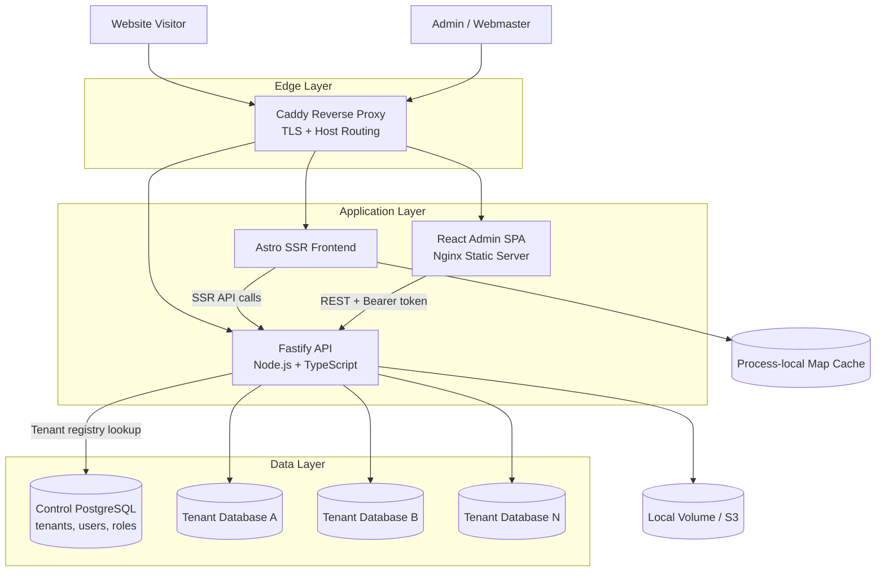
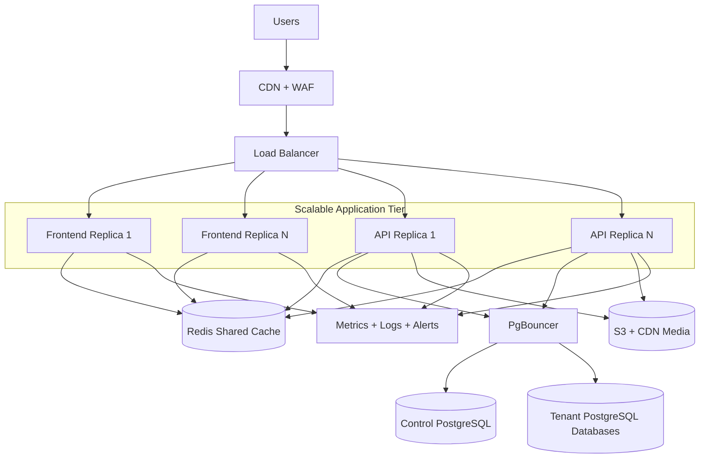

# Laporan Penambahbaikan Seni Bina dan Engineering

**Sistem:** USIM Custom Multi-Tenant Headless CMS  
**Tarikh:** 22 Ogos 2026  
**Status:** Cadangan penambahbaikan  

## 1. Ringkasan Eksekutif

Sistem ini menggunakan seni bina modular monolith dalam monorepo pnpm. Komponen utamanya ialah Fastify API, Astro SSR frontend, React admin panel, Caddy reverse proxy dan PostgreSQL.

Reka bentuk semasa sesuai untuk penggunaan institusi dan jumlah tenant yang kecil hingga sederhana. Kekuatan utama sistem ialah pengasingan database bagi setiap tenant, typed codebase, authentication, row-level security, Docker deployment dan blue-green release.

Risiko engineering utama yang perlu ditangani ialah:

1. Penggunaan connection pool yang berkembang mengikut bilangan tenant dan API replica.
2. Cache frontend yang hanya berada dalam memory setiap process.
3. Query yang mengambil keseluruhan senarai content sebelum mencari berdasarkan slug.
4. SSR yang menyebabkan setiap page request bergantung kepada API dan database.
5. Ketiadaan load test, metrics prestasi dan capacity baseline yang rasmi.

**Penilaian keseluruhan semasa: 7/10.** Sistem mempunyai asas engineering yang baik, tetapi lapisan data dan performance perlu diperkukuh sebelum menyokong traffic tinggi atau banyak tenant secara agresif.

## 2. Skop Semakan

Semakan dibuat terhadap:

- `apps/api`
- `apps/frontend`
- `apps/admin`
- `docker-compose.yml`
- `docker-compose.release.yml`
- `Caddyfile`
- konfigurasi database, migration dan connection pool
- authentication, tenant resolution dan caching
- typecheck serta API tests

Pengesahan semasa codebase:

- Typecheck API, frontend dan admin: lulus.
- API tests: 34/34 lulus.
- Load test production: belum dijalankan.

## 3. Seni Bina Semasa



### Model seni bina

Sistem ini dikategorikan sebagai:

- **Modular monolith:** satu API utama dengan modul auth, tenant, CRUD, storage dan backup.
- **Three-tier architecture:** presentation, application dan data layer.
- **Database-per-tenant multi-tenancy:** data content tenant diasingkan ke database tersendiri.
- **SSR headless CMS:** frontend mengambil content melalui API dan menjana HTML di server.
- **Containerized deployment:** aplikasi dijalankan menggunakan Docker Compose dan Caddy.

## 4. Kekuatan Engineering

### 4.1 Pengasingan tenant yang baik

Setiap tenant mempunyai database tersendiri. Ini mengurangkan risiko data tenant bercampur dan memudahkan backup atau pemindahan tenant.

### 4.2 Type safety dan modularity

Codebase TypeScript, Drizzle ORM dan konfigurasi collection generik mengurangkan pengulangan route serta kesilapan semasa perubahan schema.

### 4.3 Security asas yang kukuh

Sistem mempunyai beberapa lapisan perlindungan:

- Bearer session token.
- TOTP/MFA.
- Helmet dan CORS.
- Sanitization HTML.
- Row-level security PostgreSQL.
- Tenant validation berdasarkan registry.
- Login rate limiting.

### 4.4 Deployment yang matang untuk skala awal

Blue-green deployment dan Caddy upstream routing membolehkan release dengan downtime minimum. API dan frontend juga boleh dijalankan dengan lebih daripada satu replica.

### 4.5 Pengujian asas tersedia

Typecheck dan test suite API telah disediakan. Ini merupakan asas yang baik untuk menambah integration test, performance test dan security regression test.

## 5. Dapatan dan Risiko

### P1 — Risiko connection pool PostgreSQL

API menggunakan control-plane pool sehingga 20 connections bagi setiap replica. Setiap tenant database pula mempunyai pool sehingga 5 connections bagi setiap tenant dan setiap replica.

Anggaran maksimum bagi `N` tenant aktif dan `R` API replica:

```text
Total connections ≈ (20 × R) + (5 × N × R)
```

Contoh 10 tenant dan 3 API replica:

```text
(20 × 3) + (5 × 10 × 3) = 210 connections
```

Nilai ini boleh melebihi default PostgreSQL biasa. `docker-compose.yml` semasa tidak menunjukkan PgBouncer yang aktif, walaupun dokumentasi menyebutnya sebagai sebahagian daripada deployment.

**Impak:** request boleh beratur, timeout atau menerima error apabila connection database habis.

**Cadangan:** tambah PgBouncer, kawal jumlah pool secara global dan tetapkan connection budget setiap replica.

### P1 — Cache tidak dikongsi antara replica

Cache frontend menggunakan `Map` dalam memory process. Cache hilang apabila container restart dan tidak dikongsi antara replica.

**Impak:** scaling frontend tidak semestinya mengurangkan query database. Setiap replica boleh membuat query yang sama.

**Cadangan:** gunakan Redis atau shared cache. Tetapkan TTL dan invalidation selepas content publish/update.

### P1 — Query content terlalu besar

Beberapa flow frontend mendapatkan senarai penuh pages, posts dan categories, kemudian mencari item berdasarkan slug dalam application code.

**Impak:** masa response dan saiz payload meningkat secara linear dengan jumlah content.

**Cadangan:** gunakan query terus berdasarkan slug, pagination, field selection dan index database.

### P2 — SSR bergantung kepada API bagi setiap page request

Setiap request website boleh mencetuskan beberapa API call sebelum HTML dipulangkan.

**Impak:** lonjakan traffic awam terus memberi tekanan kepada frontend, API dan PostgreSQL.

**Cadangan:** cache SSR response, gunakan CDN, gunakan stale-while-revalidate dan pertimbangkan static export bagi tenant yang contentnya tidak kerap berubah.

### P2 — Kapasiti belum disahkan secara kuantitatif

Typecheck dan unit test mengesahkan correctness asas, tetapi belum mengukur:

- requests per second;
- p95 dan p99 latency;
- connection saturation;
- throughput bagi satu tenant;
- throughput bagi banyak tenant;
- prestasi upload/media;
- behaviour semasa deploy dan restart.

**Cadangan:** wujudkan performance baseline sebelum sebarang capacity promise dibuat.

### P2 — Observability perlu diperkukuh

Logging tersedia, tetapi perlu metrik yang boleh dibandingkan dari masa ke masa.

**Cadangan:** tambah metrics untuk request count, response time, error rate, DB pool usage, cache hit rate dan tenant-level traffic.

## 6. Pelan Penambahbaikan Mengikut Keutamaan

### Fasa 1 — Stabiliti dan keselamatan operasi

Tempoh cadangan: 1–2 minggu.

- Tetapkan connection budget yang rasmi.
- Tambah PgBouncer atau database proxy.
- Hadkan pool per tenant dan per replica.
- Tambah timeout, retry policy yang terhad dan circuit breaker untuk dependency luar.
- Dokumentasikan PostgreSQL `max_connections` dan resource requirement.
- Tambah healthcheck yang membezakan liveness dan readiness.
- Tambah alert untuk connection saturation dan error rate.

**Hasil penerimaan:** sistem tidak melebihi connection budget semasa rolling deploy atau scaling dua hingga tiga replica.

### Fasa 2 — Optimisasi query dan API

Tempoh cadangan: 1–2 minggu.

- Tukar `getPageBySlug` kepada endpoint atau query slug terus.
- Tukar `getPostBySlug` kepada query slug terus.
- Tambah pagination pada semua collection list.
- Tambah limit maksimum untuk query list.
- Pilih column yang diperlukan sahaja bagi public response.
- Tambah index untuk `slug`, `status`, `published_at` dan foreign key.
- Elakkan mengambil body/layout besar bagi list view jika tidak diperlukan.

**Hasil penerimaan:** saiz response dan masa query tidak meningkat secara linear untuk page detail.

### Fasa 3 — Shared cache dan CDN

Tempoh cadangan: 2–3 minggu.

- Tambah Redis untuk cache shared.
- Cache public pages, posts, theme dan menu.
- Invalidate cache selepas create/update/delete/publish.
- Gunakan CDN untuk asset dan media.
- Tambah stale-while-revalidate untuk public content.

**Hasil penerimaan:** public traffic biasa boleh dilayan tanpa query database bagi setiap request cache hit.

### Fasa 4 — Performance testing

Tempoh cadangan: 1 minggu dan diulang setiap release besar.

Bina senario load test:

1. Satu tenant, 50 concurrent users.
2. Satu tenant, 100 concurrent users.
3. Sepuluh tenant, traffic serentak.
4. Admin read/write traffic.
5. Publish content ketika public traffic tinggi.
6. Rolling deployment ketika traffic berjalan.

Gunakan metrik berikut:

| Metrik | Sasaran awal |
|---|---:|
| p95 public page response | < 500 ms dengan cache |
| p95 API read | < 300 ms |
| Error rate | < 1% |
| Database connection usage | < 70% daripada had |
| Cache hit ratio public | > 80% |
| Availability semasa deploy | Tiada downtime yang kelihatan |

Sasaran ini perlu disesuaikan dengan hardware sebenar.

## 7. Anggaran Kapasiti Semasa

Angka berikut ialah anggaran awal, bukan jaminan production:

| Keadaan | Anggaran awal |
|---|---:|
| Concurrent public visitors, satu API replica | 30–100 |
| Concurrent public visitors selepas query/cache dioptimumkan | 100–500+ |
| API replicas | Boleh ditambah, tertakluk kepada DB pool |
| Tenant yang aktif serentak | Bergantung kuat kepada connection limit |
| High-traffic public site | Disyorkan static/CDN path |

Pengguna yang hanya membuka browser tidak sama dengan active request. Kapasiti sebenar perlu dinilai berdasarkan requests per second dan latency, bukan jumlah user login semata-mata.

## 8. Cadangan Sasaran Seni Bina Masa Hadapan



## 9. Keputusan Cadangan

### Jangka pendek

Sistem boleh digunakan untuk deployment production berskala kecil dan sederhana dengan syarat:

- jumlah replica dikawal;
- jumlah tenant aktif dipantau;
- backup PostgreSQL diuji;
- database connection usage dimonitor;
- load test asas dilaksanakan sebelum public launch.

### Jangka sederhana

Sebelum mencapai traffic tinggi, laksanakan PgBouncer, Redis/shared cache, query optimization, pagination dan CDN.

### Jangka panjang

Jika jumlah tenant meningkat dengan banyak, pertimbangkan database cluster managed, automated tenant provisioning, migration orchestration, read replica dan static publishing untuk tenant bertraffic tinggi.

## 10. Kesimpulan

Codebase mempunyai asas engineering yang baik dan menunjukkan perhatian terhadap security, tenant isolation, testing serta deployment. Model modular monolith adalah keputusan yang sesuai pada tahap semasa kerana ia mengurangkan operational complexity.

Had terbesar bukan pada Fastify atau Docker, tetapi pada cara database connection, SSR request dan content query diuruskan. Penambahbaikan paling penting ialah:

1. Kawal dan pool connection PostgreSQL.
2. Optimisasi query berdasarkan slug dan pagination.
3. Gunakan shared cache serta CDN.
4. Wujudkan load test dan performance baseline.
5. Tambah metrics serta alert production.

Selepas lima perkara ini dilaksanakan dan diuji, sistem akan lebih bersedia untuk scaling horizontal dan jumlah pengguna yang lebih besar.

